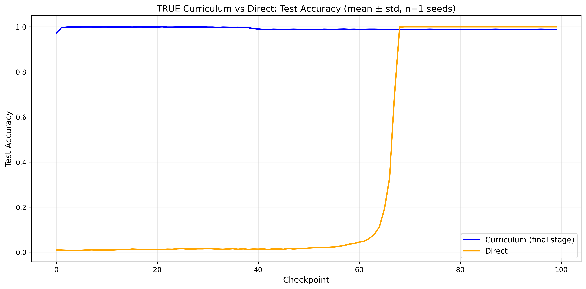
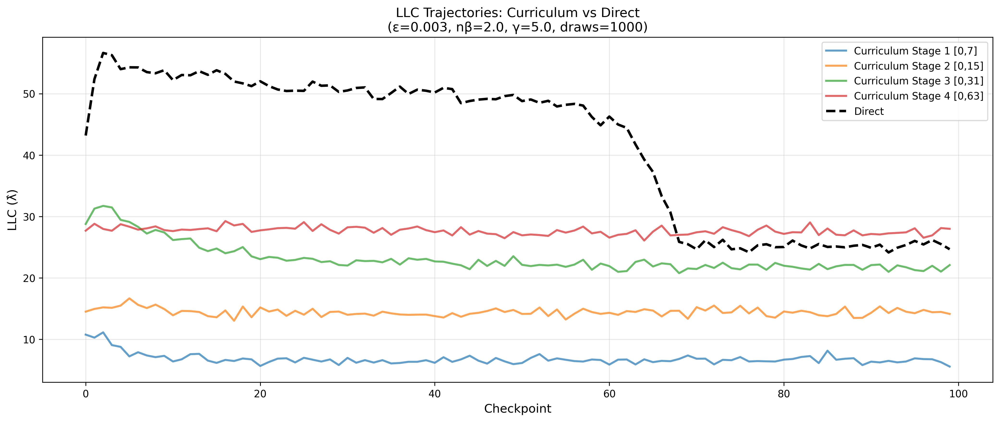
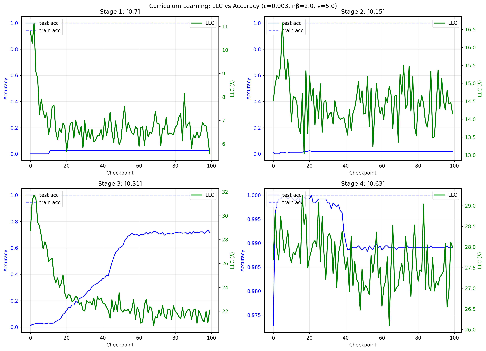
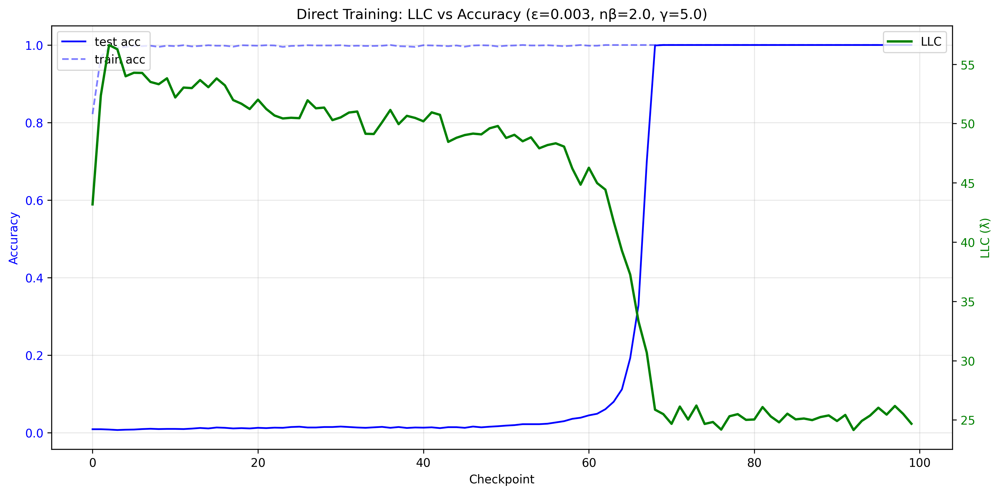
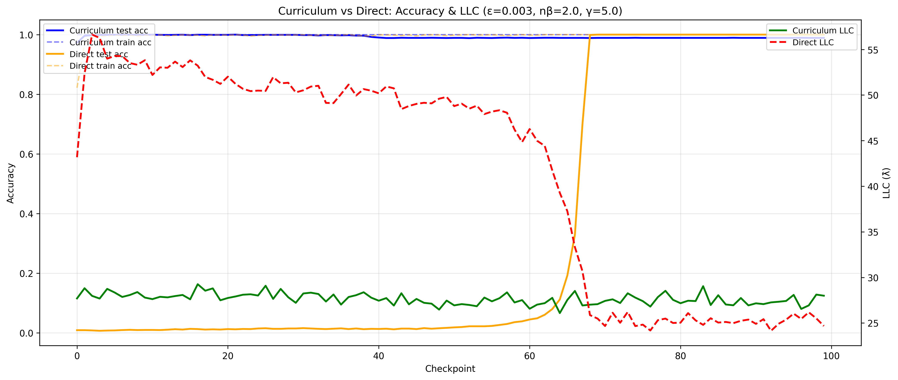
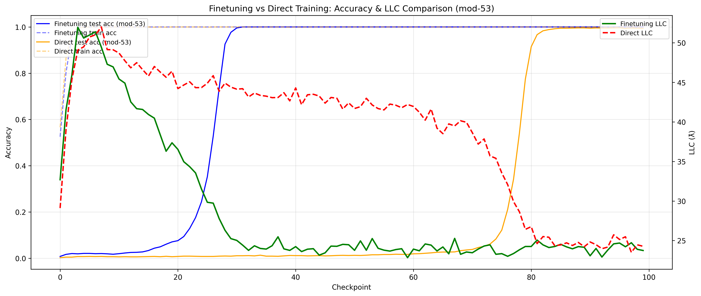
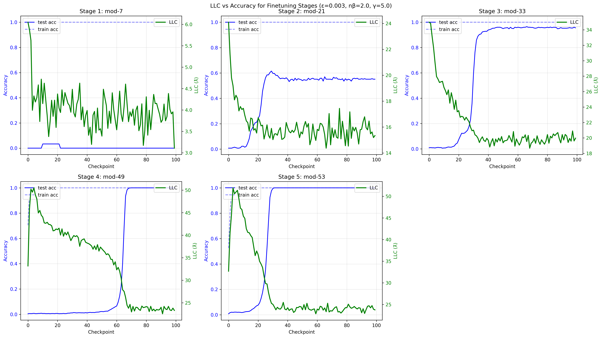
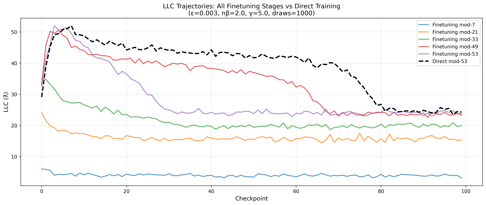

# Introduction

This repo contains my first experiments with Singular Learning Theory, Local Learning Coefficient (LLC), grokking, and developmental interpretability.

The main experiments are in `/main_experiment` and are described in detail below. They are still works in progress but interesting observations can already be seen. I aim to conduct more robust experiments in order to make more definitive conclusions and synthesize observations into a blog post.

The rest of the repo contains other extra experiments (some work, some don't) reproducing existing papers from scratch (using PyTorch).

The long-term vision of the repo is to conduct novel experiments and form conclusive insights, however the short-term goal is simply to familiarize myself with developmental interpretability through novel but simple experiments.

---

# Experiments Overview

This repo contains two main experiments exploring different training paradigms for modular arithmetic:

1. **Curriculum Learning** - Progressive difficulty with true subset property
2. **Finetuning** - Sequential training on unrelated tasks

Both experiments analyze grokking behavior and Local Learning Coefficient (LLC) trajectories using PyTorch and the devinterp library by Timaeus.

---

# Experiment 1: Curriculum Learning

**Notebook:** `main_experiment/true_curriculum_learning.ipynb`
**Results:** `results/true_curriculum/`
**Detailed Analysis:** See `results/true_curriculum/README.md`

## Curriculum Learning 
- **Same task:** All stages compute `(a+b) % 64`
- **Same vocabulary:** Fixed 64 tokens, no embedding resizing
- **True subsets:** Stage 1 ⊂ Stage 2 ⊂ Stage 3 ⊂ Stage 4
- **Progressive difficulty:** More input pairs at each stage

### Curriculum Stages

| Stage | Input Range | # Pairs | Example |
|-------|-------------|---------|---------|
| 1 | [0,7] | 64 | (3+5) % 64 = 8 |
| 2 | [0,15] | 256 | (12+9) % 64 = 21 |
| 3 | [0,31] | 1024 | (28+15) % 64 = 43 |
| 4 | [0,63] | 4096 | (55+42) % 64 = 33 |

**Direct Training:** Full dataset (4096 pairs) for 200k batches (equalized budget)

## Key Findings

### 1. Direct Training Wins on Final Performance

| Metric | Curriculum (Stage 4) | Direct Training |
|--------|---------------------|-----------------|
| **Test Accuracy** | 98.9% | **100.0%** ✓ |
| **Final LLC** | 28.0 | **24.7** ✓ (simpler) |

Direct training achieves perfect generalization and finds a simpler solution.

### 2. Critical Data Threshold: ~400 Training Pairs

The experiment reveals a sharp threshold for algorithmic learning:

| Stage | Train Pairs | Test Accuracy | Learning Type |
|-------|-------------|---------------|---------------|
| 1 | 27 | 2.7% | Memorization only |
| 2 | 97 | 1.9% | Memorization only |
| 3 | **417** | **71.8%** | **Grokking begins!** |
| 4 | 1638 | 98.9% | Full algorithm |

**Insight:** ~400 training pairs may be the critical mass needed for the model to transition from memorization to algorithmic learning of modular addition mod 64.

### 3. Different Learning Trajectories

**Curriculum LLC Evolution:**
```
Stage 1 [0,7]:    10.78 → 5.58   (memorization)
Stage 2 [0,15]:   14.52 → 14.15  (still memorizing)
Stage 3 [0,31]:   28.78 → 22.10  (grokking begins!)
Stage 4 [0,63]:   27.70 → 28.00  (full algorithm)
```

**Direct Training LLC Evolution:**
```
Direct [0,63]:    43.18 → 56.62 → 24.68  (classic grokking)
                  (memorize → explore → simplify)
```

Direct training explores much higher complexity (max LLC 56.62 vs 28.78) before collapsing to a simpler solution.

### 4. LLC Predicts Generalization

The LLC (measured only on training data) successfully predicts test set performance:
- High, stable LLC during memorization → poor generalization
- Decreasing LLC during grokking → improving generalization
- Low, stable LLC after grokking → excellent generalization

This validates SLT theory's predictions about learning and generalization.

## Visualizations

### True Curriculum vs Direct: Test Accuracy



Curriculum learning shows gradual improvement across stages, while direct training exhibits classic grokking with a dramatic phase transition around checkpoint 70.

### LLC Trajectories Comparison



The stepwise LLC progression in curriculum learning (5.58 → 14.15 → 22.10 → 28.00) contrasts with direct training's spike-and-collapse pattern (43.18 → 56.62 → 24.68), revealing fundamentally different optimization paths.

### Curriculum Learning: LLC vs Accuracy by Stage



Stage-by-stage analysis shows when grokking emerges (Stage 3) and how LLC evolves differently at each difficulty level.

### Direct Training: LLC vs Accuracy



Classic grokking behavior: train accuracy reaches 100% early while test accuracy remains poor until sudden improvement correlates with dramatic LLC decrease.

### Curriculum vs Direct: Accuracy & LLC Overlay



Side-by-side comparison showing both training approaches achieve high accuracy but through fundamentally different LLC trajectories.

## Conclusions

1. **Direct training outperforms curriculum learning** for this task (100% vs 98.9% test accuracy)
2. **~400 training pairs** represents a potential critical threshold for algorithmic learning for this task
3. **Curriculum learning reveals capability building:** Shows clear progression from memorization → partial grokking → full algorithm
4. **Multiple paths to similar solutions:** Different training procedures explore different regions of parameter space but converge to similar final performance
5. **LLC is a reliable generalization metric:** Training-only LLC successfully predicts test performance

### When to Use Curriculum Learning

Curriculum learning may be valuable for:
- Understanding data requirements at each capability level
- Improved Interpretability (clear progression of learned capabilities)
- Data-scarce regimes where full dataset isn't available

Direct training is preferable when:
- Sufficient data is available
- Final performance is paramount
- Simplicity of training procedure matters

---

# Experiment 2: Finetuning on Unrelated Tasks

**Notebook:** `main_experiment/finetuning_grokking_llc.ipynb`
**Results:** `results/finetuning/`

## Finetuning (in this context)

Unlike curriculum learning where each stage is a subset of the next, finetuning trains sequentially on **unrelated moduli** that do not contain each other:

- Train on mod-7, then finetune on mod-11, mod-23, mod-49, and finally mod-53
- Each new task is different and does **not** contain the previous one
- Tests how repeated adaptation to related but distinct tasks affects grokking

### Finetuning Stages

| Stage | Modulus | Task |
|-------|---------|------|
| 1 | 7 | (a+b) % 7 |
| 2 | 11 | (a+b) % 11 |
| 3 | 23 | (a+b) % 23 |
| 4 | 49 | (a+b) % 49 |
| 5 | 53 | (a+b) % 53 |

**Direct Training:** Train from scratch on mod-53

## Key Findings

### Finetuning Can Accelerate Grokking

Sequential finetuning on unrelated moduli demonstrates distinct learning dynamics, with faster convergence to high test accuracy compared to training from scratch on some moduli.

However, grokking doesn't always occur - it can be altered by seed and weight decay parameters. When a previous model grokked, subsequent models did not always show grokking, but when they did, they often grokked much quicker compared to direct training.

### Adaptability vs Memorization

It remains unclear whether finetuning improves or worsens adaptability. The relationship between prior grokking and future learning behavior is complex and requires further investigation.

## Visualizations

### Finetuning vs Direct Training: Accuracy and LLC



Sequential finetuning shows different learning dynamics compared to direct training, with varying grokking behavior across stages.

### Finetuning: LLC Trajectories Across All Stages



LLC evolution across all five finetuning stages (mod-7, mod-11, mod-23, mod-49, mod-53) shows how model complexity changes as the network is sequentially adapted to different modular arithmetic tasks.

### LLC Trajectories Comparison



Overlaid LLC trajectories across all finetuning stages reveal patterns in how the model adapts to new, unrelated tasks.

## Conclusions

- Finetuning can accelerate grokking when applied to tasks the model has capacity to grok
- The effect is inconsistent and depends on hyperparameters (seed, weight decay)
- Future experiments needed to determine when finetuning helps vs hurts

---

# Comparison: Curriculum vs Finetuning vs Direct

| Aspect | True Curriculum | Finetuning | Direct Training |
|--------|----------------|------------|-----------------|
| **Task Relationship** | Subsets (Stage 1 ⊂ Stage 2 ⊂ ...) | Unrelated moduli | Single task |
| **Vocabulary** | Fixed (64 tokens) | Changes per modulus | Fixed per experiment |
| **Weight Transfer** | 100% compatible | Requires adaptation | N/A |
| **Learning Pattern** | Stepwise LLC progression | Variable LLC patterns | Spike-and-collapse LLC |
| **Final Performance** | 98.9% (worse) | Varies | 100% (best) |
| **Training Complexity** | Multi-stage | Multi-stage | Simple |
| **Interpretability** | Higher | Medium | Lower |
| **Use Case** | Understanding capability building | Testing task adaptation | Maximum performance |

---

# General Observations

Both curriculum learning and finetuning can significantly decrease the number of steps to start grokking and accelerate the rate of grokking when applied to a final task that a model is known to have the capacity to grok on. However:

- Grokking doesn't always occur and can be altered by hyperparameters
- When a previous model grokked, subsequent models did not always show grokking
- When subsequent models did grok, they often did so much quicker compared to direct training
- It remains unclear whether transfer learning improves or worsens adaptability

**Future experiments** will focus on more specific conditions to verify whether curriculum learning or finetuning encourages memorization vs. grokking, and further tune the conditions necessary for grokking.

---

# How to Run

## Prerequisites
```bash
pip install -r requirements.txt
```

## Run True Curriculum Learning
```bash
cd main_experiment
jupyter notebook true_curriculum_learning.ipynb
```
Runtime: ~45-60 minutes on GPU (RTX 5090)

## Run Finetuning Experiment
```bash
cd main_experiment
jupyter notebook finetuning_grokking_llc.ipynb
```
Runtime: ~20 minutes on GPU (RTX 5090)

---

# Key Features

- **Reproducibility:** All random seeds are set for consistent results
- **Device Management:** All tensors and models automatically placed on correct device (CPU/GPU)
- **LLC Estimation:** Uses devinterp's SGLD-based estimator to compute LLC for each checkpoint
- **Visualization:** Comprehensive plots of accuracy, loss, and LLC trajectories
- **Detailed Analysis:** Complete analysis in `results/true_curriculum/README.md`

---

# Structure

```
SLT_experiments/
├── main_experiment/
│   ├── true_curriculum_learning.ipynb      # True curriculum learning experiment
│   ├── finetuning_grokking_llc.ipynb       # Finetuning experiment
│   ├── curriculum_grokking_llc.ipynb       # Old curriculum (buggy, deprecated)
│   └── grokking_mhc_experiment.ipynb       # mHC experiment
├── results/
│   ├── true_curriculum/                     # True curriculum results & analysis
│   ├── finetuning/                          # Finetuning results
│   └── curriculum_learning/                 # Old curriculum (deprecated)
└── requirements.txt
```

---

# Follow up questions

- During finetuning, when a model groks on a new, more complicated task, does it show evidence of generalization on previous tasks?
- Can we predict grokking from LLC trajectory during the first half of training?
- How can we evaluate whether a model has learned the "correct" algorithm or a different algorithm that happens to work? What if there are multiple "solutions"?

  Full list of questions is in FutureDirections.md

# References

- [devinterp GitHub](https://github.com/timaeus-research/devinterp) - Timaeus Research
- Original grokking experiment: `devinterp/examples/grokking.ipynb`
- Singular Learning Theory foundations
- [Power et al. (2022)](https://arxiv.org/abs/2201.02177) - Grokking: Generalization Beyond Overfitting on Small Algorithmic Datasets
- Claude Code + Opus 4.5 :)
